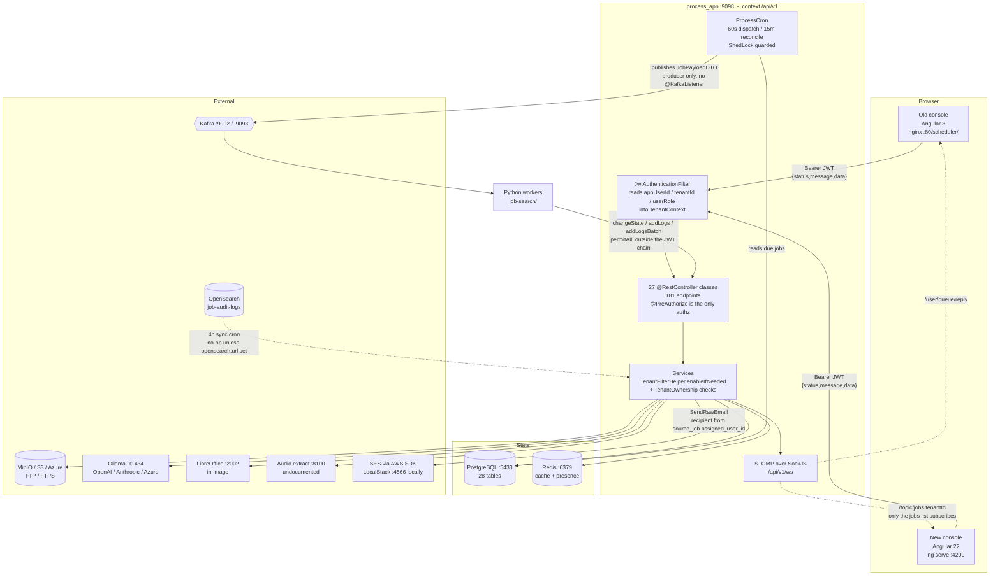

# Discovery -- Application Inventory

The one-page view of the whole system, with the detail behind it. Every claim here is traceable
to a file; paths are relative to `/Users/nabeel.amd93/Desktop/Old-School`.

This document synthesises the five inventories in `.ai/discovery/` (`frontend-old.md`,
`frontend.md`, `backend.md`, `database.md`, `infrastructure.md`) and re-verifies their load-bearing
claims against the code. Where this document and one of those five disagree, the disagreement is
called out inline.

---

## 1. What the system is

**ETL Console** is a multi-tenant job scheduler with a web console in front of it. An operator
defines a **Source Task** -- a named unit of work with an XML payload and a task type that maps to
a Kafka topic -- and then a **Source Job** that runs it, either on demand or on a recurrence
(every N minutes, hourly, daily, weekly, monthly). A cron inside the Spring Boot application
(`process/src/main/java/process/engine/cron/ProcessCron.java`) wakes every 60 seconds, finds the
jobs due in the current slot, and publishes each one's payload to Kafka as a `JobPayloadDTO`. The
application is a Kafka **producer only** -- there is not a single `@KafkaListener` in it. Python
workers in `job-search/` consume those messages, do the actual work, and report progress back
through three token-authenticated callback endpoints (`process/src/main/java/process/api/NotifyResetApi.java`),
which write run state into `job_queue`. What a worker can run is a registry keyed by pipeline id --
`PIPELINE_TASKS` in `job-search/etl/tpd/tpd_scrapping_listener.py:59-81`, **20 pipelines** as of
2026-09-08, most of them the object-storage CSV family `F768930`-`F768945` (newest: `F768945`
`csv_partition`, added 2026-09-08). The backend holds the id and validates nothing about it:
`SourceTask.pipelineId` is a plain `varchar` column (`model/pojo/SourceTask.java:74-75`) with no
whitelist on the write path, so an id that no worker registers fails **inside the worker** rather
than at save or at dispatch. `infrastructure.md` §7 has the registry detail. **Log lines have two possible homes, and which one they land
in depends on configuration** — this is the thing most likely to mislead someone reading run history.

`TransactionServiceImpl.saveJobAuditLogs` (`:56-94`) tries OpenSearch first and writes the
`job_audit_logs` table only for the lines OpenSearch refused. `AuditLogSyncCron` then syncs accepted
lines back into Postgres every four hours (`initialDelay=15s`, `fixedDelay=4h`) via
`JobAuditLogRepository.upsertFromOpenSearch`, which is an `insert … on conflict do nothing`.

The catch: `opensearch.url=${OPENSEARCH_URL:}` has an **empty default in all three profiles**
(`application-dev/stage/prod.properties`), and only `process/docker-compose.yml:174` supplies a
value. When it is empty, `OpenSearchAuditLogClient.index()` returns `false` and
`indexAllReturningFailures` returns the whole batch, so **every line falls through to Postgres**.

| How you are running | Where log lines go |
|---|---|
| The docker-compose stack | OpenSearch, with Postgres catching only rejects |
| `mvn test`, `./run-e2e.sh`, a bare `java -jar` | **Postgres only** — OpenSearch is disabled |

So neither store is authoritative on its own. Check both before concluding a run produced no logs.
The console then shows that history back: a dashboard, a run queue, per-run audit logs, and reports.

Around that core the application has grown a large surface of adjacent tooling, and this is the
thing a newcomer most often gets wrong about it -- **the scheduler is maybe a third of the
product**. The rest is a multi-provider object-storage browser (MinIO / S3 / Azure Blob / FTP /
FTPS) with an AI file chat bolted onto it, a read-only SQL query engine with saved queries and
schedules, an AI agent registry, LibreOffice document conversion, audio transcription, a PDF
field-highlighting editor, two separate form builders, and a full tenant/user administration area.
181 REST endpoints across 27 controllers.

> **That pair of numbers is stale, measured 2026-09-08.** `process/src/main/java/process/api/`
> holds **25** `@RestController` files today. The fall is the removals recorded in section 7.2 and
> in `features.md` rows 13 and 14 -- dynamic forms, PDF highlighter, the query and search engines --
> against **one addition**, `AnalyticsRestApi` with two endpoints, on 2026-09-08. The endpoint total
> was **not** recounted in the pass that added this note, so treat 181 as an upper bound rather than
> a fact; the controller count above is the one that was actually measured.

The newest of that adjacent surface, and the first part of it that runs a query engine *inside* the
application rather than calling out to one, is **Analytics Studio** (2026-09-08). It reads a data
file *where it already lives* in object storage -- no upload, no import, nothing copied into
Postgres -- by running **DuckDB
embedded in the backend JVM** against the store over the S3 protocol. An operator picks a storage
connection, walks folders exactly as in the object browser, clicks a file, and gets Overview / Data
/ Schema; a whole folder can be read as one dataset by glob. It is **phase one of a five-phase
plan** and is a deliberately narrow slice: there is no user-written SQL, no profiling, no charts,
no dashboards, no saved queries and no benchmarks. Section 8 has the detail, and is worth reading
before anyone reasons about it, because the security model is inverted from the rest of this
system: here the **engine** is the dangerous component.

Everything is scoped by **tenant**. A JWT carries `appUserId`, `tenantId` and `userRole`; a
`TenantContext` ThreadLocal is filled from those claims per request
(`process/src/main/java/process/security/TenantContext.java`), and a Hibernate `tenantFilter` is
declared on 15 of the 28 application entities. Four of those fifteen are *shared catalogues* whose
filter reads `(tenant_id = :tenantId or tenant_id is null)`, so platform-owned rows are visible to
everyone. The filter does **not** apply to `findById`, which is why
`process/src/main/java/process/security/TenantOwnership.java` exists and is referenced 87 times.

The console itself is mid-rewrite. There is an Angular 8 application in production and an Angular
22 rewrite that is feature-complete for almost everything and now has a Docker deployment
(`scheduler1/next/Dockerfile`, port 4400) — production has not cut over to it yet. Section 7
covers exactly where that stands.

---

## 2. The three deployables and the services behind them

### 2.1 The deployables

| # | Deployable | What it is | How it is served | Status |
|---|---|---|---|---|
| 1 | **Old frontend** (`scheduler1/`) | Angular 8 SPA, one eager `NgModule`, 41 components | nginx 1.27-alpine on port **80**, under the path prefix `/scheduler/` | In production. `scheduler1/Dockerfile`, `scheduler1/nginx.conf`, `scheduler1/docker-compose.yml` |
| 2 | **New frontend** (`scheduler1/next/`) | Angular 22 SPA, 83 standalone components, zoneless, signals | `ng serve` on **4200** for dev; nginx 1.27-alpine on port **4400** for a container | Dockerized (`scheduler1/next/Dockerfile`, `nginx.conf`, `docker-compose.yml`, port `4400:80`), not yet the production deployment. No CI |
| 3 | **Backend** (`process/`) | Spring Boot 2.3.2 REST API + scheduler + Kafka producer | `eclipse-temurin:17-jdk`, port **9098**, context path `/api/v1` | In production. `process/Dockerfile:2`, `process/docker-compose.yml:126-133` |

The old and new frontends target the **same** backend. Both derive the API base the same way -- as
`<page-protocol>//<page-hostname>:9098/api/v1` -- the old one baked in at build time
(`scheduler1/webpack.config.js:52-59`), the new one computed at runtime
(`scheduler1/next/src/app/core/api/api.config.ts:6`). Neither has an environments file, so **any
deployment where the API is not on port 9098 of the same host needs a source change and a rebuild**.

### 2.2 The supporting services

Started by `process/docker-compose.yml` unless noted:

| Service | Image | Host port | Purpose |
|---|---|---|---|
| `postgres` | `postgres:15` | **5433** → 5432 | The single application database |
| `zookeeper` | `confluentinc/cp-zookeeper:7.5.0` | 2181 | Kafka coordination |
| `kafka` | `confluentinc/cp-kafka:7.5.0` | 9092 (INTERNAL), **9093** (EXTERNAL) | Job dispatch. `kafka:9092` for containers, `localhost:9093` for host clients |
| `redis` | `redis:7-alpine` | 6379 | Lookup cache, file-extraction cache (7 days), websocket presence |
| `kafka_ui` | `provectuslabs/kafka-ui:latest` | 8085 | Broker inspection |
| `redisinsight` | `redis/redisinsight:latest` | 5540 | Redis inspection |
| `process_app` | built from `process/Dockerfile` | **9098** | The API |
| MinIO | owned by `job-search/docker-compose.integrated.yml` | 9000 | Default object store, reached over `host.docker.internal` |
| OpenSearch | owned by `job-search/docker-compose.integrated.yml` | -- | Audit-log source for the 4-hourly sync cron. No-op unless `opensearch.url` is set |
| Ollama | external to every compose file | 11434 | Local LLM host, default `http://host.docker.internal:11434` |
| LocalStack (`localstack-aws`) | external to every compose file | 4566 | **SES for outbound mail.** Since 2026-09-08 mail goes through the AWS SES SDK, not SMTP. On the default `bridge` network while `process_app` is on `process_default`, so it is reached at `host.docker.internal:4566` -- the Ollama route |
| LibreOffice | installed *inside* the `process_app` image | 2002 (in-container) | Document conversion and report export, driven by jodconverter 4.4.7 |
| DuckDB | **no image, no process.** A ~70 MB jar with bundled native libraries, `org.duckdb:duckdb_jdbc:1.1.3` | **none -- in-process** | Analytics Studio's query engine (section 8). Embedded in the `process_app` JVM, opened and closed per query, reaching object storage itself over the S3 protocol. Nothing to start, nothing to connect to, and **not** a second application database |
| Audio extraction | external, **undocumented** | 8100 | Default `http://host.docker.internal:8100`. Nothing in this repository says what runs there |
| Python workers | `job-search/docker-compose.yml` | -- | Kafka consumers; call back to `host.docker.internal:9098` |

Three addressing schemes coexist and this is where most operational confusion comes from: compose
DNS (`kafka:9092`, `postgres:5432`), host-published ports (`localhost:9093`, `localhost:5433`), and
`host.docker.internal`.

### 2.3 How a request flows



Two things in that diagram are worth stating in words because they are easy to miss:

- **The worker callbacks are not on the JWT chain.** `/changeState/**`, `/addLogs/**` and
  `/addLogsBatch/**` are `permitAll` in `process/src/main/java/process/config/SecurityConfig.java:42`;
  the only thing authenticating them is a constant-time comparison of the `X-Worker-Token` header
  against `WORKER_CALLBACK_TOKEN`. The application refuses to start if that variable is unset
  (`NotifyResetApi.java:56-64`).
- **The websocket has exactly one consumer in the new app.** `JobEventsService` is a root singleton
  connected for the whole session, but only `scheduler1/next/src/app/features/jobs/jobs.ts`
  subscribes. Queue, Job History, Dashboard and the notification bell all poll instead.

---

## 3. Technology, with versions

### 3.1 Old frontend -- `scheduler1/`

Read from `scheduler1/package.json`, `scheduler1/webpack.config.js`, `scheduler1/Dockerfile`.

| Thing | Version | Note |
|---|---|---|
| Angular | ^8.0.0 | `@angular/core`, no `@angular/cli` build -- Webpack drives it directly |
| TypeScript | ^3.1.3 | |
| Webpack | ^4.32.2 | `npm run build` = `webpack --mode production` |
| Node (build) | 14-bullseye-slim | `scheduler1/Dockerfile:5` |
| nginx (serve) | 1.27-alpine | `scheduler1/Dockerfile:36` |
| echarts / ngx-echarts | ^4.9.0 / ^5.2.2 | Every chart in the old app is echarts |
| pdfjs-dist | ^2.16.105 | PDF preview *and* the highlighter's canvas editor |
| marked | ^4.3.0 | Markdown in the file-chat replies |
| stompjs / sockjs-client | ^2.3.3 / ^1.3.0 | Live job updates |
| Bootstrap / jQuery / DataTables | 3.4.1 / 3.4.1 / 1.10.2 | **Loaded from CDNs at runtime** (`scheduler1/src/index.html:10-17`), not bundled. DataTables is loaded and never called |
| Test framework | **none** | No `test` script, no karma, no jest anywhere in `scheduler1/package.json` |

### 3.2 New frontend -- `scheduler1/next/`

Read from `scheduler1/next/package.json`.

| Thing | Version | Note |
|---|---|---|
| Angular | ^22.1.0 | Zoneless change detection, standalone components, signals throughout |
| `@angular/cdk` | ^22.1.3 | Menus, dialogs, overlays |
| TypeScript | ~6.0.2 | `strictTemplates` on |
| Tailwind CSS | ^4.3.3 | Configured entirely inside `scheduler1/next/src/styles.css` (1219 lines), no `tailwind.config` |
| Vitest | ^4.0.8 | `npm test` → `ng test` |
| `@stomp/stompjs` / sockjs-client | ^7.3.0 / ^1.6.1 | |
| pdfjs-dist | ^6.2.108 | Dynamically imported, object preview only |
| libphonenumber-js | ^1.13.12 | E.164 phone validation |
| echarts, ngx-echarts, marked, file-saver | declared | **Never imported anywhere in `src`.** Every chart is hand-built SVG/CSS and the markdown parser is hand-written in `shared/ui/markdown.ts` |

Counts verified directly, 2026-09-08: **83** non-spec files declare `@Component`; **46**
`.spec.ts` files. Both moved since 2026-09-01, in opposite directions -- 87 components and 31
specs then. The components fell because a whole feature was deleted rather than migrated --
`dynamic-forms` on 2026-09-03 (`features.md` row 13); `features/forms/` no longer exists and
neither route it owned is in `app.routes.ts`. Nothing was consolidated. (`pdf-highlighter`, removed
on 2026-09-07, does not appear in this number: it never had a component in the new app.)

**Re-counted after Analytics Studio shipped later on 2026-09-08: 84 components, 46 specs.** The
single component is `features/analytics/analytics.ts`, standalone and signal-based like the rest.
The spec count did **not** move, and that is the honest gap in the feature: the Studio component
has no unit test of any kind, so the frontend suite's 580 passing tests are the same 580 that
passed before it existed. Its two dependencies -- `features/objects/storage.service.ts` for the
file picker and `features/analytics/analytics.service.ts` for the reads -- are likewise unspecced.

### 3.3 Backend -- `process/`

Read from `process/pom.xml`, `process/Dockerfile`.

| Thing | Version | Note |
|---|---|---|
| Spring Boot | 2.3.2.RELEASE | `pom.xml:10` |
| Java source level | 1.8 | `pom.xml:20` -- `<java.version>1.8</java.version>` |
| Java runtime | JDK 17 | `process/Dockerfile:2`, `eclipse-temurin:17-jdk` |
| Spring Kafka | 2.5.12.RELEASE | Producer only |
| Springfox Swagger | 2.9.2 | Docket selects **every** handler, `permitAll` in every profile |
| jodconverter | 4.4.7 | Drives the in-image LibreOffice on port 2002 |
| jsqlparser | 4.6 | Re-validates every saved query before it runs; 4.6 is the last release before a Java 11 floor |
| Apache POI | 3.15 | Parses user-uploaded xlsx. Several major versions behind |
| Velocity | 1.7 | Six email templates, classpath-only |
| `software.amazon.awssdk:ses` | 2.25.60 | Outbound mail, `pom.xml:265-271`. `SendRawEmail`, so the existing MIME building is unchanged. Same SDK and version as the S3 client. The SMTP path survives as `@Deprecated` behind `app.mail.transport=smtp` |
| jjwt | 0.11.5 | HS256, 30-min access / 7-day refresh |
| MinIO SDK, AWS SDK, azure-storage-blob | see `pom.xml:236-263, 273-277` | The four storage providers. The `ses` artifact at `pom.xml:265-271` sits inside that block but is mail, not storage |
| `org.duckdb:duckdb_jdbc` | 1.1.3 | Added 2026-09-08, `pom.xml:277-281`. Analytics Studio's engine. ~70 MB because it ships native libraries, so it is by some way the heaviest single dependency here. Runtime verified on Java 17 Temurin, linux/aarch64, Ubuntu 26.04. The driver is loaded in a static block (`analytics/DuckDbSessionFactory.java:53`) so a missing or mismatched native library names itself at startup rather than on the first user's first click |

### 3.4 Database

One PostgreSQL 15 database. **28 application tables**, and the central fact about the schema is that
it is defined in two places: Liquibase changesets create only **six** of them (`shedlock`,
`lookup_data`, `source_task_type`, `task_form`, `task_form_field`, `tenant_request`); the other
**22** exist only because Hibernate's `ddl-auto=update` built them from `@Entity` mappings. 30 files
live in `process/src/main/java/process/model/pojo/`, of which `AuditListener` and `Audited` are not
entities.

The migration chain is 25 numbered changelogs, V1--V25 with V4--V7 excluded, in
`process/src/main/resources/db/changelog/`. `ddl-auto` is `update` in dev and `validate` in
stage/prod.

**Analytics Studio did not change any of the above, and that is worth stating rather than
assuming.** Phase one adds no `@Entity`, no repository, no table and no changeset: `pojo/` gained
no file, and `db/changelog/changelog-sets/` gained no directory (the newest there is still
`V30.0-drop-email-receiver`). There is no `AnalyticsDataset`, `SavedQuery`, `QueryHistory`,
`Dashboard` or `BenchmarkResult`. A dataset is not persisted at all -- it is a connection alias
plus a path, resolved per request, and the user's selection lives only in the browser.

Which leads to the sentence most worth carrying out of this section: **DuckDB is not a second
application database.** It holds no schema, no user data and no state between queries. Its
in-memory catalogue and the storage credentials attached to it are created when a query opens a
session and destroyed when that session closes, one session per query and no pool -- which is also
how one caller is prevented from seeing another caller's dataset. Nothing about the 28 PostgreSQL
tables changes because a file was read.

---

## 4. The three roles

The hierarchy is declared once on the server and mirrored once on the client:

- `process/src/main/java/process/config/MethodSecurityConfig.java:29` --
  `ROLE_PLATFORM_ADMIN > ROLE_TENANT_ADMIN` and `ROLE_TENANT_ADMIN > ROLE_TENANT_USER`.
- `scheduler1/next/src/app/core/auth/auth.guard.ts` -- a numeric `ROLE_RANK` so a route names the
  single *lowest* role that may open it (`data.minRole`), and `auth.hasAtLeast()` decides the rest.

The old frontend does **not** mirror the hierarchy: `RoleGuard` reads `route.data.roles` as a flat
list, so every admin route has to name `PLATFORM_ADMIN` beside `TENANT_ADMIN` and the first one to
forget locks a platform admin out of a page the API would serve them.

| Capability | TENANT_USER | TENANT_ADMIN | PLATFORM_ADMIN |
|---|---|---|---|
| Sign in, own profile, own password, own avatar | yes | yes | yes |
| Read jobs, tasks, queue, dashboard, reports, notifications | yes | yes | yes |
| **Create / update / delete / run / skip a Source Job** | **yes** | yes | yes |
| **Rewrite a run's status** (`failJobLogs`, `interruptJobLogs`, `changeJobStatus`) | **yes** | yes | yes |
| Browse object storage (which bucket and key is decided per request, not by role) | yes | yes | yes |
| Read AI agents, run a saved query, read query connections and history | yes | yes | yes |
| Create / update / delete a Source Task | no | yes | yes |
| Source task types, task forms, dynamic form definitions, lookups | no | yes | yes |
| Storage connections, Kafka connection profiles, Kafka secrets | no | yes | yes |
| Query definitions and schedules | no | yes | yes |
| AI agents (write), Ollama model pull/delete | no | yes | yes |
| Users -- create, update, activate/deactivate, reset password | no | yes (own tenant, and **may only create TENANT_USERs**) | yes |
| Tenants -- create, update, suspend | no | no | yes |
| Workspace requests -- list, approve, reject | no | no | yes |
| Ad-hoc SQL against the application database (`setting.json/dynamicQueryResponse`) | no | no | yes |
| Subscribe to `/topic/jobs.all` | no | no | yes |
| Actuator beyond `health` and `info` | no | no | yes |

Two rows in that table are the ones worth arguing about, and both are verified from the annotations:

- `SourceJobRestApi` carries a single class-level `@PreAuthorize("hasRole('TENANT_USER')")` with no
  override on the write methods, so **any signed-in user can create, delete, run and skip any job
  in their tenant**.
- `MessageQRestApi` is the same shape, and three of its four endpoints mutate run state.

Authorization exists **only** on controllers. There is no `@PreAuthorize` in any service in
`process/src/main/java/process/model/service/`. There is also no revocation: role, tenant and
account status come from the token claims with no per-request user read
(`JwtAuthenticationFilter.java:40-47`), so deactivating a user or suspending a tenant only takes
effect when the 30-minute access token expires.

---

## 5. Where everything lives on disk

```
/Users/nabeel.amd93/Desktop/Old-School
├── process/                                  the backend (deployable 3)
│   ├── src/main/java/process/
│   │   ├── api/                              25 @RestController classes -- NOT process/rest/
│   │   │                                     (was 27; see the note in section 1)
│   │   ├── analytics/                        added 2026-09-08. AnalyticsLimits, DuckDbSessionFactory,
│   │   │                                     DatasetRef, DatasetResolver, AnalyticsException,
│   │   │                                     AnalyticsQueryService, dto/. No entity, no repository
│   │   ├── config/                           SecurityConfig, MethodSecurityConfig, Kafka*, Storage*
│   │   ├── engine/                           cron/ProcessCron.java, ProducerBulkEngine, JobPayloadDTO
│   │   ├── emailer/                          Velocity templates + EmailMessagesFactory
│   │   ├── model/pojo/                       30 files -- 28 entities + AuditListener + Audited
│   │   ├── model/repository/                 Spring Data repositories
│   │   ├── model/service/impl/               all business logic; no authorization here
│   │   ├── security/                         TenantContext, TenantOwnership, TenantFilterHelper,
│   │   │                                     JwtAuthenticationFilter, StompAuthChannelInterceptor
│   │   ├── socket/                           JobEventPublisher, WebSocketPresenceService
│   │   └── util/                             JwtUtil, EncryptionUtil, excel/BulkExcel, validation/
│   ├── src/main/resources/
│   │   ├── application{,-dev,-stage,-prod}.properties
│   │   └── db/changelog/                     db.changelog-master.yaml + changelog-sets/V1..V25
│   ├── src/test/java/process/                88 test files (see section 6)
│   │   └── analytics/                        DatasetResolverTest (13 tests),
│   │                                         DuckDbLockdownTest (7, against a real DuckDB)
│   ├── kafka-it/                      throwaway 7-listener Kafka security stack
│   ├── docker-compose.yml, Dockerfile
│   └── run_process_docker.sh, run-e2e.sh, run-kafka-matrix.sh,
│       run-kafka-provisioning.sh, docker-compose.sh
│
├── scheduler1/                               the OLD frontend (deployable 1)
│   ├── src/app/
│   │   ├── app.routing.ts                    all 42 routes, flat, no lazy loading
│   │   ├── app.component.ts/.html            navbar, notification bell, user card
│   │   ├── _component/                       39 components in 24 directories
│   │   ├── _services/                        26 services, all providedIn:'root'
│   │   ├── _helpers/                          AuthGuard, RoleGuard, auth.interceptor,
│   │   │                                     search-filter pipe, job-status-chart.helper
│   │   ├── _models/                          domain interfaces (several carry logic)
│   │   └── global-config.ts                  240 lines incl. a literal 1,440-entry TIMES array
│   ├── webpack.config.js                     bakes apiUrl to <host>:9098/api/v1
│   ├── Dockerfile, nginx.conf, docker-compose.yml, DEPLOYMENT.md
│   ├── patch.js, patch_dist.js               run with `|| true` -- silent on failure
│   │
│   └── next/                                 the NEW frontend (deployable 2)
│       ├── src/app/app.routes.ts             6 public routes + 38 lazy shell children
│       ├── src/app/core/                     auth/ (service, guard, interceptor, models),
│       │                                     api/api.config.ts (15 lines), socket/, theme.service.ts
│       ├── src/app/features/                 one directory per screen
│       ├── src/app/shared/ui/                TableShell, FormDialog, Field, StatusPill, ViewToggle,
│       │                                     Pagination, Confirm, markdown.ts, phone-input.ts
│       ├── src/app/shared/charts/            hand-built SVG: bar-chart, donut, heatmap,
│       │                                     ranked-bar, split-bar, status-color.ts
│       ├── src/styles.css                    1219 lines -- the entire design system
│       ├── angular.json, package.json
│       └── Dockerfile, nginx.conf, docker-compose.yml   4400:80, added 2026-09-03
│
├── job-search/                               Python Kafka workers + MinIO/OpenSearch/Ollama stack
│   ├── etl/tasks/                            one module per pipeline; 20 are registered
│   ├── etl/tpd/tpd_scrapping_listener.py     PIPELINE_TASKS -- the id -> (module, function) registry
│   └── etl/util/xml_parser.py                pipeline_xml_parser -- the id -> payload parser registry
│                                             OUT OF SCOPE for this phase
│
└── .ai/
    ├── discovery/                            frontend-old.md, frontend.md, backend.md,
    │                                         database.md, infrastructure.md,
    │                                         application-inventory.md (this file), features.md
    ├── grooming/                             one file per feature row in features.md
    ├── synthesis/                            one file per feature row in features.md
    ├── execution/, qa/, regression/, reports/, old-scope/, prompts/
    └── project.md, README.md
```

Two directory facts that repeatedly trip people up:

- The controllers are in **`process/src/main/java/process/api/`**. There is no `process/rest/`
  directory; `ls` on it returns nothing.
- The new frontend lives **inside** the old one, at `scheduler1/next/`. It is a separate npm project
  with its own `package.json` and `node_modules`.

---

## 6. Test inventory

### 6.1 What exists

| Suite | Where | Size | Verified how |
|---|---|---|---|
| **New frontend unit tests** | `scheduler1/next/src/**/*.spec.ts` | **46 files, 580 tests, all passing** | Ran `npx ng test --watch=false` on 2026-09-08 -- output: `Test Files 46 passed (46)` / `Tests 580 passed (580)`, 4.67s. Was 31 files / 445 tests on 2026-09-01 |
| **Backend unit + slice tests** | `process/src/test/java/process/` | **88 Java files, 675 `@Test` methods** (9 of them `@ParameterizedTest`). `mvn test` reported **607 passing** later on 2026-09-08 -- the gap to 675 is the `*IT` suites Surefire's default includes skip | `find` + `grep -c`, 2026-09-08. Was 86 files / 655 `@Test` / 587 passing earlier the same day, and 71 files / 564 `@Test` on 2026-09-01 |
| **Backend e2e** | `process/src/test/java/process/e2e/` | 8 files, 88 `@Test`. Runs against the **live dev database** on `localhost:5433` | `find` + `grep -c` |
| **Kafka security matrix** | `process/src/test/java/process/config/KafkaSecurityMatrixIT.java` | 17 cases across 7 listeners | `process/kafka-it/` |
| **Old frontend tests** | -- | **None. Zero.** | `scheduler1/package.json` has only `build` and `start` scripts, and no karma, jest or any test dependency |

Backend `@Test` methods by package, re-counted 2026-09-08 (2026-09-01 figures in brackets where
they differ):

| Package | Files | `@Test` |
|---|---|---|
| `model/` | 45 (34) | 347 (284) |
| `util/` | 14 (11) | 108 (78) |
| `e2e/` | 8 | 88 |
| `config/` | 11 | 68 |
| `emailer/` | 4 (3) | 17 (12) |
| `security/` | 1 | 10 |
| `api/` | 1 | 9 |
| `engine/` | 2 | 8 (15) |
| `analytics/` | 2 (0) | 20 (0) |
| **Total** | **88** (71) | **675** (564) |

The `analytics/` row is new on 2026-09-08 and is the whole of the +20. It is also the one part of
this suite that tests a *refusal* against the real thing rather than against a mock:
`DuckDbLockdownTest` opens an actual DuckDB session and asserts it cannot read a local file, cannot
write one, cannot raise its own memory ceiling, cannot re-enable the local filesystem, and refuses
an FTP connection by name -- plus a positive control asserting the locked-down session **still
works**, without which the other four would pass on a session that had simply been broken.
`DatasetResolverTest`'s 13 cases are the input side: cross-tenant refusal, `..`, a SQL
metacharacter, a soft-deleted connection, and the property that the bucket comes from the
connection record and never from the request.

That `api/` row is the whole story of the backend's test coverage: **one** of 27 controllers has a
test (`NotifyResetApi`, the worker callbacks). 20 controllers were untouched at any level and 17
service implementations were referenced by no test at all on 2026-09-01; **those two counts were
not re-measured on 2026-09-08**, but `api/` is unchanged at 1 file / 9 tests, so the controller
half of the claim still holds. The suite is overwhelmingly a *tenant-isolation and Kafka-security*
suite, not a functional one, and the net 91 methods added since 2026-09-01 did not change that
shape -- they land in `model/`, `util/` and `emailer/`, not in `api/`.

**The newest controller did not change that either.** `AnalyticsRestApi` arrived on 2026-09-08 with
no controller test, so `api/` is still 1 file and 9 tests. What its feature *is* tested on sits in
`analytics/`, one layer below the controller -- which is a defensible place for it, since the
resolver and the session factory are where the security properties actually live, but it does mean
the HTTP contract itself (the `TENANT_USER` gate, the missing-parameter behaviour, business
failures returning 200 with an `ERROR` body) is exercised only by hand.

The `engine/` row went **down** while everything else went up: it is now `FallbackMessageTest` (5)
and a new `cron/AuditLogSyncCronOrphanSkipTest` (3), so a file that was there on 2026-09-01 is not
there now. What it covered was **not** established -- treat that row as an open question rather
than as a net gain.

### 6.2 Exact commands

```bash
# New frontend -- 46 files, 580 tests, ~5s
cd /Users/nabeel.amd93/Desktop/Old-School/scheduler1/next
npx ng test --watch=false          # or: npm test  (watch mode)

# New frontend -- production build
npm run build

# Backend -- unit and slice tests
cd /Users/nabeel.amd93/Desktop/Old-School/process
mvn test

# Backend -- e2e. Reads credentials out of the RUNNING process_app container via
# `docker exec printenv`, so process_app must be up first. Runs against localhost:5433
# with Liquibase off, ddl-auto=none, @Transactional rollback. Only LibreOffice is mocked.
./run-e2e.sh                       # wraps: mvn -o test -Dtest='*E2EIT,HarnessSmokeIT'

# Backend -- Kafka security matrix, 17 cases.
# MUST run inside a container: every test listener is advertised as host.docker.internal,
# which the host cannot resolve. A host run fails with 13 node-assignment timeouts while
# the 4 never-connecting cases still pass -- i.e. it looks half-green and means nothing.
cd /Users/nabeel.amd93/Desktop/Old-School/process/kafka-it && ./start.sh
cd /Users/nabeel.amd93/Desktop/Old-School/process && ./run-kafka-matrix.sh
cd /Users/nabeel.amd93/Desktop/Old-School/process/kafka-it && ./stop.sh

# Backend -- Kafka provisioning driver. WRITES ROWS THAT SURVIVE and puts real store files
# in the platform bucket. Gated behind -DprovisionKafka=true for that reason.
./run-kafka-provisioning.sh

# Start the whole backend stack, with the stale-jar guard
./run_process_docker.sh            # refuses to start if target/process-1.0-0.jar is older
                                   # than anything under src/main, then polls health for 300s

# Old frontend -- build and serve
cd /Users/nabeel.amd93/Desktop/Old-School/scheduler1
npm run build                      # webpack --mode production
docker-compose up -d               # nginx on :80, app at http://localhost/scheduler/
```

### 6.3 What is missing from the tooling

- **No lint config** anywhere in `scheduler1/next` -- no ESLint setup.
- **No e2e framework** for either frontend -- no Playwright, no Cypress. `scheduler1/next/README.md`
  is still stock Angular CLI text, including an `ng e2e` section for a framework that is not
  installed.
- **No coverage gate.** `angular.json`'s test target has no options block.
- **No CI pipeline** for anything, in any of the three deployables.
- `process/src/test/resources/application-e2e.properties:22` sets `process.scheduling.enabled=false`
  with a comment saying the crons would otherwise dispatch real jobs during tests. **That property
  is read nowhere in the codebase** and `ProcessConfig.java:20` carries an unconditional
  `@EnableScheduling`. The kill-switch does nothing; the e2e suite runs against the real dev
  database with crons live.

---

## 7. The state of play

### 7.1 Done

**The backend is the mature part of the system.** 181 endpoints, a coherent three-role
authorization model, encryption at rest for 11 secret columns, a real migration history, and an
unusually well-commented set of operational scripts where each guard records the mistake it exists
to prevent. It serves both frontends unchanged.

**The old frontend is in production.** It is the reference for what the product does -- but it is
no longer the 42-route application described above. `grep -c "path:" scheduler1/src/app/app.routing.ts`
returns **29** on 2026-09-08: the seven Dynamic Forms routes, the three PDF Highlighter routes,
`setting/queryEngine`, `setting/searchEngine` and `setting/lookpXml` have all been deleted from it.
The first two groups were product decisions recorded in `features.md` rows 13 and 14; the query and
search engines went with Liquibase changeset `V27.0-drop-query-engine`.

**The new frontend is functionally very close**, and `features.md` has the route-by-route mapping
-- with the caveat recorded in its own section 4 that the mapping predates those removals on both
sides. It also adds capabilities the old app never had, including reports, a job assistant,
self-service workspace requests, a profile screen and dark mode. Structurally it is a much better application: 19 list
screens share one `TableShell` for loading/error/empty states, 16 dialogs share one `FormDialog`,
`Field` is the single source of validation messages, and one `statusColor()` table decides the
colour of every status pill *and* every chart segment so they cannot drift.

**Analytics Studio phase one is built, tested and deployed** (2026-09-08) -- the first module in
this system that runs a query engine of its own. What that sentence covers and what it does not is
in section 8; the short version is that the read path works against MinIO and S3, the governor and
the session lock-down were built *first* so that later phases have somewhere safe to land, and
everything a reader would call "analytics" in the ordinary sense -- SQL, profiling, charts,
dashboards -- is not built.

### 7.2 In flight

**The rewrite can now be containerized, but has not cut over.** `scheduler1/next/` gained a
Dockerfile, an nginx config and a compose service on 2026-09-03 (`docker compose up -d --build`,
port `4400:80`), matching the old app's shape and verified end to end — build, health check, SPA
deep-link fallback, and a live login round trip against the real backend on `:9098` with CORS
intact. What is still missing, and still blocks a production cutover: **no CI** (the old app has
none either, so this does not widen the gap, but neither app's build is automated), and no
deployment *decision* has been made — the container exists, production still points at `scheduler1/`.

**The rewrite's test coverage is inverted, though less so than it was.** 580 tests pass
(2026-09-08, up from 445 on 2026-09-01), and the newer specs are real component tests rather than
more extracted pure logic: `dashboard`, `queue`, `tasks/edit`, `admin/tenants`, `notifications`,
`tools/converter` and `tools/transcript` each now have a `TestBed` spec, which closes most of the
list this paragraph used to name. The 978-line Kafka TLS section also has one
(`settings/kafka/kafka-tls-section.spec.ts`).

**Nine feature directories still have no spec of any kind**, verified by `find` on 2026-09-08:
`bulk`, `docs`, `landing`, `login`, `profile`, `shell`, `tenant-request`, `unauthorized`, and --
the largest of them -- the object browser itself, whose three specs are all under `objects/chat/`
and none of which touch the browser component. The best-covered feature is still the job assistant.

~~**PDF Highlighter is active work in the old app that the rewrite has not picked up.**~~
**Closed 2026-09-07 by deleting the feature**, not by migrating it (`features.md` row 14). When
this was written the two most recent commits on the branch were `86c2269 PDF Highlighter` and
`4c07a7a pdf highlighter xpath added`, and the rewrite was chasing a moving target. Re-verified
2026-09-08: `scheduler1/src/app/_component/` has no `pdf-highlighter` directory, `grep -rli
highlighter scheduler1/src` matches one stray reference in `welcome.component.ts`,
`process/src/main/java/process/api/` has no PDF controller, and `grep -rli PdfHighlighter
process/src/main/java` returns nothing. Both the moving target and the gap are gone.

**Both frontends hard-code port 9098** with no build-time or runtime override, and there is no
`environments/` directory or `fileReplacements` in `scheduler1/next/angular.json`.

### 7.3 Not started

- **Secrets hygiene.** `process/.env.bak.1787579140` is committed to git and holds all ten keys from
  `.env.example` including `SPRING_DATASOURCE_PASSWORD`, `MAIL_PASSWORD` and
  `WORKER_CALLBACK_TOKEN`. `process/.gitignore:35` covers `.env` and `.env.local` but has no pattern
  for `.env.bak.*`. Separately, `process/docker-compose.yml` carries literal fallback values for
  `LOOKUP_ENCRYPTION_KEY` (L162), `JWT_SECRET_KEY` (L166) and the SMTP mail credentials (L156-157),
  so a stack started without `.env` runs on a public signing key. `job-search/env` is also committed
  and holds Mongo credentials. One of those four is now defused rather than fixed: since the move to
  SES (§3.3) the `MAIL_USERNAME`/`MAIL_PASSWORD` pair is read only at `app.mail.transport=smtp`, so
  on a default stack it is a committed credential nobody uses -- still to be deleted, no longer to
  be rotated first.
- **A buildable stage or prod database.** `ddl-auto=validate` there means Hibernate creates nothing,
  Liquibase creates only 6 of 28 tables, and there is no baseline dump or
  `docker-entrypoint-initdb.d` seed anywhere in the repo. The 22 Hibernate-owned tables -- `tenant`,
  `app_user`, `source_job`, `source_task`, `scheduler`, `job_queue`, `job_audit_logs` and the rest
  -- have **no creation path** on those environments.
- **Any stage or prod deployment path at all.** Both profiles exist and differ meaningfully from
  dev, but there is no compose file, Dockerfile arg, CI pipeline or deployment script for either
  anywhere in the workspace.
- **CORS.** All 27 controllers carry `@CrossOrigin(origins = "*")`, `AuthRestApi` included.
  `SecurityConfig` enables `.cors()` but registers no `CorsConfigurationSource`, and `WebConfig` is
  an empty `WebMvcConfigurer` -- so the annotation is the entire policy.
- **Swagger exposure.** `permitAll` in every profile with a Docket that selects every handler,
  publishing the full 181-endpoint surface unauthenticated. No profile guard.
- **Token revocation.** There is no denylist anywhere in the codebase.
- **A first-run path.** `PLATFORM_ADMIN_BOOTSTRAP_PASSWORD` is set nowhere in the workspace -- not in
  compose, not in `.env.example` -- so `TenantSeedService.java:108-110` logs an error and seeds no
  platform admin. A first run against an empty database comes up with **no account to sign in as**.
- **Analytics Studio phases two to five.** Phase one shipped on 2026-09-08 (§8) and stops at
  reading a dataset. SQL Studio, profiling and data quality, charts and dashboards, and benchmarks
  are all planned, approved and unstarted -- as is the audit-log entry and Kafka event the
  specification asked for on a dataset read, which phase one does not emit. `AnalyticsRestApi`
  also carries the same blanket `@CrossOrigin(origins = "*")` as every other controller, so the
  CORS bullet above gained one more instance rather than an exception.

### 7.4 Corrections to the source inventories

Two claims in `frontend-old.md` section 7 do not survive checking, and both matter because they
would otherwise become migration work that is already done:

1. **§7.6 "Table / card view toggle, persisted per user" is listed as having no successor.** It does.
   `scheduler1/next/src/app/shared/ui/view-toggle.ts` is a shared `ViewToggle` component that
   persists the choice per screen in `localStorage` under `etl.view.<key>`, and **11 feature screens
   use it** -- including `tasks/tasks.ts` and `ai/agents/agents.ts`, two of the three screens the
   claim names. The search that produced the claim looked for the identifier `viewMode`, which the
   new app does not use. What *is* genuinely missing is the toggle on the **jobs list**:
   `features/jobs/jobs.ts` does not import `ViewToggle` (verified, zero matches), so Source Job lost
   its card view while Source Task and AI Agent kept theirs.

2. **The old app's bucket-file affordances on two tools are missing, which §7.8 does not cover.**
   `features/tools/cleaner/cleaner.ts` was 40 lines and contained no reference to a bucket or to PDF
   extraction -- the old Content Cleaner could browse a bucket file and extract PDF text in-browser
   via pdf.js. And `features/tools/transcript/transcript.ts` can *read* from a bucket but has no
   `uploadObject` call, so the old ability to save a transcript back into a bucket folder, and to
   reopen an already-saved `.txt`, has no successor. Both are recorded in `features.md`.

   **Half of that has since been overtaken.** Re-checked 2026-09-08: `features/tools/` now holds
   only `converter/` and `transcript/` -- the Content Cleaner screen is gone from the new app
   altogether, and `contentCleaner` is still a live route in the old one, so this is no longer a
   thinner successor but a missing one. The transcript half is unchanged and still stands
   (`grep -c uploadObject transcript/transcript.ts` returns 0). Whether the cleaner was dropped
   deliberately is **not established here** -- see the note in `features.md` section 4.

Everything else in the five inventories that this document depends on was re-checked and held. In
particular: the controllers really are in `process/api/` and not `process/rest/` (the task brief
named the latter); there really are 181 endpoints (27 class-level `@RequestMapping` plus 181
method-level ones across 27 files -- `NotifyResetApi` is the one controller with no class-level
mapping, which is why a naive count comes out at 180); and `SettingRestApi.xmlCreateChecker` really
is declared `path = "xmlCreateChecker"` with no leading slash (`SettingRestApi.java:172`), the only
endpoint in the codebase written that way.

---

## 8. The analytics module

Added 2026-09-08. This section describes **phase one of five**, which is all that exists. Read
section 8.6 before drawing conclusions about what the module can do.

### 8.1 What it is

An operator picks a storage connection, walks folders, clicks a file, and gets three tabs --
**Overview**, **Data**, **Schema**. The file is read *where it already lives*. Nothing is uploaded,
imported, staged or copied into Postgres. A whole folder can be read as **one** dataset by naming a
glob rather than a file.

The engine is **DuckDB, embedded in the `process_app` JVM** (`org.duckdb:duckdb_jdbc:1.1.3`), which
reaches the object store itself over the S3 protocol through its `httpfs` extension. That is the
architectural point of the feature: a one-gigabyte scan never streams through Spring and never
lands on a disk the application owns. It is also why the build got roughly 70 MB heavier: the
DuckDB jar ships native libraries rather than being pure Java.

### 8.2 The files

| Where | What |
|---|---|
| `process/src/main/java/process/analytics/AnalyticsLimits.java` | A `@Component` reading the six properties in 8.5. The entire policy in one bean, rather than `@Value` scattered across the classes that enforce it |
| `.../analytics/DuckDbSessionFactory.java` | Builds the only kind of DuckDB session allowed to exist. See 8.4 |
| `.../analytics/DatasetRef.java` | A location the server **has agreed** to read. `Format` enum: `CSV`, `TSV`, `JSON`, `PARQUET`. Its constructor is package-private |
| `.../analytics/DatasetResolver.java` | The only way to obtain a `DatasetRef`, which is what makes the checks in 8.4 unskippable |
| `.../analytics/AnalyticsException.java` | A failure whose message is written for a person to read |
| `.../analytics/AnalyticsQueryService.java` | The only place in the application an analytics query runs |
| `.../analytics/dto/` | `ColumnDto`, `DatasetSchemaDto`, `DatasetPreviewDto` |
| `process/src/main/java/process/api/AnalyticsRestApi.java` | The two endpoints in 8.3 |
| `scheduler1/next/src/app/features/analytics/` | `analytics.service.ts` (`schema()`, `preview()`), `analytics.ts`, `analytics.html` |

Route `analytics` in `app.routes.ts:133`, **with no `roleGuard`** and a comment on the route saying
why: the same reason as the object browser, namely that the per-connection tenant check performed
on every request is the real gate and a role on the route would only be theatre. Nav entry
"Analytics Studio" sits beside "Object Browser" in `features/shell/shell.ts:88`.

**The frontend introduces no new UI primitives**, which was the intent. The left rail drives the
**existing** `features/objects/storage.service.ts` -- `buckets()` and `listObjects()`, called at
`analytics.ts:104` and `:146` -- rather than a second copy of the storage walk, and the screen
reuses `shared/ui`'s `TableShell`, `StatTile`, `Icon` and `formatSize` plus
`shared/charts/number-format`'s `compactNumber`.

### 8.3 The API

```
GET /analytics.json/schema   ?connection=<alias>&path=<path>
GET /analytics.json/preview  ?connection=<alias>&path=<path>&page=0&pageSize=<optional>
```

Both sit under a single class-level `@PreAuthorize("hasRole('TENANT_USER')")`, matching
`StorageBrowserRestApi`. Business failures are **HTTP 200 with a `ResponseDto` of status `ERROR`**,
per the house convention every other controller here follows; only an unexpected exception is a 500.

**The design point worth repeating anywhere this API is described: the caller names a CONNECTION
and a path inside it. It never names a bucket and it never names a URL.** The bucket comes from the
`StorageConnection` record -- `getBucketName()`, falling back to the alias, which is exactly what
`StorageBrowserServiceImpl` does. So "use these credentials against a different bucket" is not a
request this API is capable of expressing, and no amount of parameter tampering makes it one.

This was a mid-build change and is worth knowing as such. The first design took
`storageConnectionId` + `bucket` + `path`; switching to the alias both matched the object browser's
own addressing and deleted a whole class of request. One test became obsolete when it happened and
was replaced by one asserting the stronger property -- that the bucket comes from the record.

### 8.4 The security model

**The threat here is inverted from the rest of this system.** Everywhere else the application is
trusted and the input is not. Here the **engine** is the dangerous component: DuckDB can read and
write local files, open sockets and install extensions, and it runs as the backend process. The
module is built around confining it.

`DuckDbSessionFactory.open()` does the following, and the **order is the mechanism**:

| # | Step | Why it is where it is |
|---|---|---|
| 1 | `SET memory_limit` / `threads` / `preserve_insertion_order=false` | The resource ceiling, before anything can be run |
| 2 | `INSTALL` + `LOAD` `httpfs` (S3, MinIO) or `azure` (Azure Blob) | The allow-listed extension is the only one present. FTP and FTPS are refused **by name** rather than being allowed to fail somewhere inside a scan |
| 3 | `CREATE OR REPLACE SECRET analytics_store (...)` | Credentials are attached as a **secret**, never interpolated into query text, so they cannot surface in a query plan or an error message |
| 4 | `SET disabled_filesystems='LocalFileSystem'` | Removes the local reader outright, rather than relying on every future call site to remember not to use it |
| 5 | `SET lock_configuration=true` | **Last**, so nothing downstream can loosen any of the four above |

Three details of that method carry as much weight as the steps:

- **A session that fails part-way through configuration is closed, not returned.** A
  half-configured session is an *unlocked* one, and it must never escape the method.
- **The driver is loaded in a static block** (`DuckDbSessionFactory.java:53`), so a missing or
  wrong-architecture native library names itself at application startup rather than under the first
  user who clicks a file.
- **The memory-limit property is regex-restricted before interpolation.** It is an operator-supplied
  string that ends up inside SQL, and a mistyped value of `512MB'; SET lock_configuration=false`
  would otherwise unlock the engine. `DuckDbLockdownTest` asserts the rejection.

`DatasetResolver` runs **before any session is opened**, and because `DatasetRef`'s constructor is
package-private, there is no call site that can skip it:

- an **allow-list** on the path -- `[A-Za-z0-9._*?/=+ -]+`, permitting the two glob characters a
  multi-file dataset needs and excluding the quote that would end a SQL literal and the backslash
  that would escape one;
- a **separate `".."` check**, because `..` is made entirely of permitted characters;
- `findByAlias`, then `status != Delete`, then `TenantOwnership.isVisibleToCaller`;
- `provider.isObjectStore()` (`DatasetResolver.java:84`), so an FTP or FTPS connection is refused
  with a reason;
- a second, narrower allow-list on the bucket the record produced -- `[A-Za-z0-9._-]+`, without the
  glob characters, since a bucket is always one exact name. The bucket is server-supplied and is
  still checked, which is the point;
- format detection from the extension.

And one property that is easy to lose in a refactor: **"does not exist" and "belongs to another
workspace" return identical wording** (`"Storage connection not found."`), so an alias cannot be
used as an enumeration oracle for other tenants' connections.

`AnalyticsQueryService` is the governor:

- a **fair `Semaphore`** sized by `analytics.query.max-concurrent`, which waits 2 seconds and then
  **refuses rather than queues** -- a queue under load turns one slow query into a stalled console;
- `setQueryTimeout` from `analytics.query.timeout-seconds`;
- **one session per query, closed with it, and deliberately not a pool.** The in-memory catalogue
  and the attached credentials die with the connection, which is how one caller is prevented from
  seeing another caller's dataset;
- an `explain()` that maps DuckDB's errors to sentences a person can act on -- *"Nothing to read at
  `<bucket>/<path>`. The connection worked, so check the path."* -- while logging anything it does
  not recognise **in full** rather than returning it.

The governor and the lock-down were built **first**, before any of the analysis features, precisely
so that phase three's user-written SQL has somewhere safe to land instead of arriving alongside its
own containment.

### 8.5 Configuration

Six properties, declared in `application-dev`, `-stage` and `-prod`, and added to the existing
`ApplicationPropertiesDeclarationTest` (`:46-51`) -- which matters here more than usual, because
**an absent limit is an unlimited one**:

| Property | Value |
|---|---|
| `analytics.query.timeout-seconds` | 30 |
| `analytics.query.max-rows` | 10000 |
| `analytics.query.max-concurrent` | 4 |
| `analytics.preview.page-size` | 100 |
| `analytics.duckdb.memory-limit` | 512MB |
| `analytics.duckdb.threads` | 2 |

Each is `${ENV_VAR:default}` in the properties files, so all six are overridable per deployment
without a rebuild -- unlike the API port both frontends hard-code (§7.2).

Runtime verified on **Java 17 Temurin, linux/aarch64, Ubuntu 26.04**.

### 8.6 What was verified, and what was not

Exercised through the real API and the real UI against MinIO on 2026-09-08:

- `sales.csv` -> 7 rows, 4 columns, format CSV; schema `region` / `rep` / `product` `VARCHAR`,
  `amount` `DOUBLE`;
- a **glob over three partition files** read as **one** dataset -> 7 rows, 5 columns, the fifth
  being a filename column carrying `s3://etl-bucket/etl-demo/F768945/out/<file>.csv` per row;
- a Parquet read, schema and rows;
- five refusal paths, each returning a friendly `ERROR` and never a stack trace -- among them
  *"A dataset path cannot contain \"..\"."*, *"That path contains characters this reader does not
  accept."* and *"Analytics Studio does not read this file type yet. It reads CSV, TSV, JSON and
  Parquet."*;
- an absolute path `/etc/passwd.csv`, which is confined **inside the connection's bucket** and,
  separately, has no local filesystem left to reach -- both layers of the defence observed working,
  not just the outer one;
- dark mode correct, no page overflow, no console errors.

**What is not built, and must not be read into the above.** Phase one is a slice:

- **No user-written SQL, no profiling, no data-quality checks, no charts, no dashboards, no saved
  queries, no benchmarks.** These are phases two to five and none of them is started. Monaco is not
  a dependency of this project and the SQL-editor decision is still open.
- **Azure is untested.** S3 and MinIO share the S3 protocol and were both verified. Azure needs
  DuckDB's separate `azure` extension; the code branches for it (`DuckDbSessionFactory.java:131-133`)
  but it has **never been exercised against a real container**. Do not describe Azure as working.
- **No frontend unit tests** for the Studio component, its service, or the file picker. The 580
  figure in section 6 is unchanged for that reason.
- **No database changes of any kind** -- see §3.4.
- **No caching.** Schema and row counts are recomputed on every request.
- **No Kafka event and no audit-log entry** for a dataset read or a query. The specification asked
  for both; neither is built, so a read leaves no trace beyond the application log.
- **The preview has no `ORDER BY`**, because object storage has no natural row order. Paging is
  therefore only as stable as the reader's own ordering happens to be.
- **`explain()` maps a fixed set of DuckDB error strings.** An engine error outside that set becomes
  the generic *"The dataset could not be read."* and is logged in full.
- **The concurrency ceiling is per JVM, not per tenant.** One workspace can occupy all four slots
  and make the feature unavailable to every other workspace on the instance.
