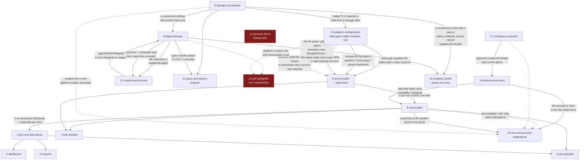

# Discovery -- Feature Map

The canonical list. Every later grooming and synthesis document is one row of the table below:
`.ai/grooming/<feature>.md` and `.ai/synthesis/<feature>.md` take their filenames from the
**Feature** column, so those names are fixed from here on.

Paths are relative to `/Users/nabeel.amd93/Desktop/Old-School`.

**Sources.** Routes were read from `scheduler1/src/app/app.routing.ts` (42 routes) and
`scheduler1/next/src/app/app.routes.ts` (6 public + 38 lazy shell children + a wildcard). Endpoints
were read from the 27 controllers in `process/src/main/java/process/api/` -- 181 method-level
`@RequestMapping` declarations -- and matched against the calls each screen actually makes. Entities
are the 28 `@Entity` classes in `process/src/main/java/process/model/pojo/`.

**Coverage.** Every route in both applications appears in exactly one row. Old: 42 of 42. New: 45 of
45. The per-route accounting is in section 4.

**How to read Status.** Status describes the **old → new migration only**:

- `migrated` -- everything the old app did here has a successor in the new app.
- `partial` -- some of the old capability has no successor. Each loss is itemised in section 2.
- `not-migrated` -- old app only; nothing in the new app serves it.
- `new` -- new app only; the old app never had it.

A row can be `migrated` and still have gained capability the old app never had. Those additions are
listed separately in section 3 rather than being folded into the status, so that `partial` always
and only means *something was lost*.

---

## 1. The canonical feature table

| # | Feature | Old FE route | New FE route | Backend endpoints | Entities | Status |
|---|---|---|---|---|---|---|
| 1 | `authentication-and-access` | `''` (Welcome), `login`, `unauthorized`, `**`→`home` | `''` (Landing), `login` (+ signed-in redirect), `docs`, `unauthorized`, `**`→`''` | `auth.json/login`, `auth.json/refresh` | AppUser, Tenant | migrated |
| 2 | `dashboard` | `home` | `dashboard`, shell `''`→`dashboard` | `dashboard.json/jobStatusStatistics`, `/jobRunningStatistics`, `/weeklyRunningJobStatistics`, `/weeklyHrsRunningJobStatistics`, `/weeklyHrRunningStatisticsDimension` | JobQueue, SourceJob, Scheduler | migrated |
| 3 | `source-jobs` | `jobList`, `addJob`, `editJob/:jobId` | `jobs`, `jobs/new`, `jobs/:jobId/edit` | `sourceJob.json/listSourceJob`, `/addSourceJob`, `/updateSourceJob`, `/deleteSourceJob`, `/toggleSourceJobStatus`, `/runSourceJob`, `/skipNextSourceJob`, `/fetchSourceJobDetailWithSourceJobId`; `sourceTask.json/listSourceTask`; STOMP `/topic/jobs.{tenantId}` | SourceJob, Scheduler, SourceTask, JobQueue | partial |
| 4 | `job-runs-and-queue` | `jobList/jobHistory`, `jobList/jobLogs`, `setting/queueMessage` | `jobs/history`, `jobs/:jobId/history`, `jobs/:jobId/runs/:jobQueueId/logs`, `queue` | `sourceJob.json/fetchSourceJobQueueListWithJobId`, `/findSourceJobAuditLog`; `dashboard.json/weeklyHrRunningStatisticsDimensionDetail`; `message.json/fetchLogs`, `/failJobLogs`, `/interruptJobLogs`, `/changeJobStatus` | JobQueue, JobAuditLogs, SourceJob | partial |
| 5 | `job-assistant` | -- | `jobs/:jobId/assistant` (+ panels inside `jobs` and `jobs/:jobId/history`) | `sourceJob.json/askAssistant`; `fileChat.json/exportFile` | SourceJob, JobQueue, JobAuditLogs | new |
| 6 | `source-tasks` | `taskList`, `addTask`, `editTask/:taskDetailId` | `tasks`, `tasks/new`, `tasks/:taskDetailId/edit`, `settings/forms` | `sourceTask.json/listSourceTask`, `/addSourceTask`, `/updateSourceTask`, `/deleteSourceTask`, `/fetchSourceTaskWithSourceTaskId`, `/fetchAllLinkJobsWithSourceTaskId`; `setting.json/xmlCreateChecker`, `/appSetting`, `/fetchSubLookupByParentId`; `taskForm.json/listForms`, `/formForPipeline`, `/saveForm`, `/deleteForm` | SourceTask, SourceTaskPayload, SourceTaskType, TaskForm, TaskFormField, LookupData | partial |
| 7 | `bulk-transfer` | `jobList/jobBatchAction`, `taskList/taskBatchAction` | `jobs/bulk`, `tasks/bulk` | `sourceJob.json/downloadSourceJobTemplateFile`, `/downloadListSourceJob`, `/uploadSourceJob`; `sourceTask.json/downloadSourceTaskTemplate`, `/downloadListSourceTask`, `/uploadSourceTask` | SourceJob, Scheduler, SourceTask, SourceTaskPayload | migrated |
| 8 | `object-browser` | `objectBrowser` | `objects` | `storage.json/buckets`, `/listObjects`, `/objectMetadata`, `/previewObject`, `/downloadObject`, `/uploadObject`, `/createFolder`, `/deleteObject`, `/deleteObjects`, `/deleteFolder`, `/renameFolder`; `fileShare.json/send`; `fileChat.json/prepareContext`, `/sendMessage`, `/exportFile`, `/endSession`; `aiAgent.json/fetchAllAgents` | none of its own (buckets are external); AiAgent for file chat | migrated |
| 9 | `storage-connections` | `setting/storageConnection` | `admin/storage` | `storageConnection.json/fetchAllConnections`, `/fetchConnectionById`, `/addConnection`, `/updateConnection`, `/cloneConnection`, `/testConnection`, `/discoverBuckets`, `/deleteConnection` | StorageConnection, KafkaConnectionProfile (delete-dependency check) | migrated |
| 10 | `reports` | -- | `reports` | `report.json/runs`, `report.json/export` | JobQueue, SourceJob | new |
| 11 | `query-and-search-engines` | `setting/queryEngine`, `setting/searchEngine` | `tools/query`, `tools/search` | `queryEngine.json/connections/*` (6), `/queries/*` (7), `/executions/*` (4), `/schedules/*` (5); `setting.json/dynamicQueryResponse` | QueryDefinition, QuerySchedule, QueryExecution, DatabaseConnectionProfile | migrated |
| 12 | `content-and-ai-tools` | `documentConverter`, `audioTranscriptExtractor`, `contentCleaner`, `aiAgent`, `ollamaModels` | `tools/converter`, `tools/transcript`, `tools/cleaner`, `ai/agents`, `ai/models` | `documentConverter.json/supportedFormats`, `/convert`, `/fetchAllTasks`, `/fetchTaskById`, `/deleteTask`; `audioTranscript.json/extractFromUpload`, `/extractFromBucket`; `textCleaner.json/clean`; `aiAgent.json/fetchAllAgents`, `/fetchAgentByAgentId`, `/addAgent`, `/updateAgent`, `/deleteAgent`, `/fetchToolByUuid`, `/processAdHoc`; `ollama.json/listModels`, `/pullModel`, `/deleteModel` | DocumentConverterTask, AiAgent, LookupData (`AI_PROVIDER`) | partial |
| 13 | `dynamic-forms` | `dynamicForm`, `dynamicForm/new`, `dynamicForm/edit/:dynamicFormId`, `dynamicForm/fill/:dynamicFormId`, `dynamicForm/fill/:dynamicFormId/edit/:submissionId`, `dynamicForm/submissions/:dynamicFormId`, `dynamicForm/submissions/:dynamicFormId/:submissionId` | ~~`settings/dynamic-forms`, `f/:uuid`~~ (removed) | ~~`dynamicForm.json/*` (15 endpoints)~~ (removed) | ~~DynamicForm, DynamicFormField, DynamicFormSubmission~~ (removed) | **removed 2026-09-03** |
| 14 | ~~`pdf-highlighter`~~ | ~~`pdfHighlighter`, `pdfHighlighter/new`, `pdfHighlighter/:pdfHighlighterTaskId`~~ | **none** | ~~`pdfHighlighter.json/fetchAllPdfHighlighterTask`, `/fetchPdfHighlighterTaskById`, `/addPdfHighlighterTask`, `/updatePdfHighlighterTask`, `/deletePdfHighlighterTask`, `/fetchPdfHighlighterFields`, `/syncPdfHighlighterFields`, `/uploadPdfHighlighterFile`, `/downloadPdfHighlighterFile`~~ | ~~PdfHighlighterTask, PdfHighlighterField~~ | **removed 2026-09-07** (was not-migrated) |
| 15 | `platform-configuration` | `setting` (Source TaskType + Kafka tabs), `setting/lookup`, `setting/subLookup`, `setting/lookpXml` | `settings/task-types`, `settings/kafka`, `settings/lookup`, `settings/xml`, `admin/settings` | `setting.json/addSourceTaskType`, `/updateSourceTaskType`, `/deleteSourceTaskType`, `/appSetting`, `/addLookupData`, `/updateLookupData`, `/fetchSubLookupByParentId`, `/deleteLookupData`, `/fetchKafkaRoute`, `/setKafkaRoute`, `/deleteKafkaRoute`, `xmlCreateChecker`; `kafkaConnectionProfile.json/fetchAllProfiles`, `/addProfile`, `/updateProfile`, `/deleteProfile`, `/setAsDefault`, `/clearDefault`, `/testConnection`, `/testTopic`; `kafkaSecret.json/uploadSecret`, `/generateTruststore`, `/generateKeystore`; `sourceTask.json/fetchAllLinkSourceTaskWithSourceTaskTypeId` | SourceTaskType, TenantTaskTypeKafkaRoute, KafkaConnectionProfile, LookupData | partial |
| 16 | `tenants-and-users` | `tenants`, `users` | `admin/tenants`, `admin/users` | `tenant.json/listTenants`, `/addTenant`, `/updateTenant`, `/changeTenantStatus`; `appUser.json/listUsers`, `/addUser`, `/updateUser`, `/changeUserStatus`, `/resetPassword`, `/avatar`; `dashboard.json/userStatistics` | Tenant, AppUser | migrated |
| 17 | `workspace-requests` | -- | `request-workspace`, `admin/tenant-requests` | `tenantRequest.json/submit`, `/listRequests`, `/approve`, `/reject` | TenantRequest, Tenant, AppUser | new |
| 18 | `own-account-and-notifications` | `notifications` | `profile`, `notifications` (+ header bell) | `appUser.json/me`, `/updateOwnProfile`, `/changeOwnPassword`, `/updateOwnAvatar`; `sourceJob.json/myActivity`; `notification.json/list`, `/unreadCount`, `/markRead/{notificationId}`, `/markAllRead` | AppUser, Notification, JobQueue | migrated |
| 19 | `analytics-studio` | -- | `analytics` | `analytics.json/schema`, `/preview`. The file picker calls no analytics endpoint of its own -- it reuses `storage.json/buckets` and `/listObjects` | **none.** Phase one adds no database objects at all | new |

19 features. Counts by status: **8 migrated, 6 partial, 4 new, 1 not-migrated.** *(Was 18 features
and 3 `new` until row 19 `analytics-studio` was added on 2026-09-08.)*

> **Status re-checked 2026-09-08 after a defect-fix pass; nothing moved.** Four rows were worked on
> -- 10 `reports`, 4 `job-runs-and-queue`, 16 `tenants-and-users`, 18
> `own-account-and-notifications` -- and each was measured against the status definitions above
> rather than against the size of the change. Status here means old → new **parity**, so a fix only
> moves it if it restores something the old app could do, and none of these did:
>
> - **10 `reports`** stays `new` by definition: the old app has no reports screen to have parity
>   with. What changed is real but belongs in section 3, which has been updated -- a Workspace
>   dimension, three execution-time measures, list filters shared by every tile and chart, and
>   summing chart kinds refused for measures that cannot honestly be summed.
> - **4 `job-runs-and-queue`** stays `partial`. The queue screen's donut, failure rate and counts
>   now read the same filtered `data()` computed as its table (`features/queue/queue.ts:88`), which
>   fixes a screen that contradicted itself -- but §2.7's loss is the Gantt-style start→end
>   comparison, and `shared/charts/` still contains no timeline component (re-checked: `bar-chart`,
>   `day-series`, `donut`, `heatmap`, `histogram`, `ranked-bar`, `split-bar`, `status-color`).
> - **16 `tenants-and-users`** was already `migrated`, and a pipeline count under the task count on
>   `/admin/tenants` (`SourceTaskRepository.countDistinctPipelinesByTenantId`) is an addition, not a
>   recovered old-app capability.
> - **18 `own-account-and-notifications`** was already `migrated`. `markRead` now separates
>   already-read from not-found, and Redis unread counts are cleared when an account stops being
>   Active; both sit behind endpoints this row already lists.
>
> The counts above are unchanged **by this pass**. They are, separately, out of date for another
> reason -- see the note in section 4.

> **Row 19 `analytics-studio` added 2026-09-08**, the only row this table has gained since it was
> written. It reads `new` because the status column measures old → new **parity** and nothing else:
> the old app has no analytics screen for the new one to have parity with, and `partial` is reserved
> by the definitions above for a row where something was *lost*. Read that `new` narrowly. It says
> the old app never had this; it does **not** say the feature is finished. What shipped on
> 2026-09-08 is **phase one of five**, and it is a deliberately thin slice: a file in object storage
> is read where it lies, through DuckDB, and shown as Overview / Data. There is **no
> user-written SQL, no profiling, no data-quality checks, no charts, no dashboards, no saved
> queries and no benchmarks** -- those are phases two to five, none of them started. A reader
> planning against this row should treat it as "the read path exists", not as "the module exists".
>
> The row's empty **Entities** cell is a fact about the design rather than an omission. Phase one
> adds no `@Entity`, no repository and no Liquibase changeset: there is no `AnalyticsDataset`,
> `SavedQuery`, `QueryHistory`, `Dashboard` or `BenchmarkResult` table, and a chosen dataset is not
> persisted anywhere -- the selection lives only in the component's signals and dies with the page.
> Nothing is copied into Postgres, and nothing is cached; schema and row counts are recomputed on
> every request.

Row 18 merges the personal account area into one row: the notification centre (which the old app
had, and which migrated intact) and the profile screen (which the old app did not have). Per the
Status rule above it reads `migrated`, because nothing was lost; the profile screen and avatars are
listed as additions in section 3.

### Backend surface no feature row claims

Three endpoint groups exist on the server and are called by neither frontend. They are listed here
rather than being attached to a feature, because the decision about them is "keep, delete, or build
a UI for", not "migrate":

| Endpoint | Controller | Called by old FE? | Called by new FE? |
|---|---|---|---|
| `changeState/jobId/{jobId}/jobQueueId/{jobQueueId}/jobStatus/{jobStatus}` | `NotifyResetApi` | no -- worker callback | no |
| `addLogs/jobId/{jobId}/jobQueueId/{jobQueueId}` | `NotifyResetApi` | no -- worker callback | no |
| `addLogsBatch/jobId/{jobId}/jobQueueId/{jobQueueId}` | `NotifyResetApi` | no -- worker callback | no |

The three worker callbacks are machine-to-machine by design and correctly have no UI. Separately,
five endpoints are declared in the old app's services but called by no old screen, and appear
nowhere in the new app either -- `aiAgent.json/processAdHoc`, `aiAgent.json/fetchAgentByAgentId`,
`storageConnection.json/fetchConnectionById`, `queryEngine.json/executions/fetchByQueryId`,
`documentConverter.json/fetchTaskById`. They are dead in both clients and want an explicit decision.

---

## 2. Not migrated

Everything below is an old-app capability with **no successor in `scheduler1/next`**. Each claim was
verified by searching the whole of `scheduler1/next/src` for the identifier or endpoint string named
in the Evidence column, not inferred from the route list.

### 2.1 PDF Highlighter -- the entire feature

> **DECISION (2026-09-07): removed, not migrated.** The section below describes what existed in
> the old app at the time this document was written; it has since been deleted outright (both
> tables, the backend entity/repository/controller, and this legacy screen/service). See
> `.ai/synthesis/pdf-highlighter.md`'s decision banner for the reasoning.

The only whole-feature gap, and the largest single decision this phase hands forward.

Searching `scheduler1/next/src` for `highlighter`, case-insensitively, returns **zero files**.
Nothing in `app.routes.ts` or `features/shell/shell.ts` mentions it.

| What is lost | Where it lives in the old app |
|---|---|
| 3 routes | `scheduler1/src/app/app.routing.ts` -- `pdfHighlighter`, `pdfHighlighter/new`, `pdfHighlighter/:pdfHighlighterTaskId` |
| 2 components, ~943 lines of TS | `scheduler1/src/app/_component/pdf-highlighter/**` |
| The pdf.js canvas + drag-to-draw overlay editor | `pdf-highlighter-detail.component.ts` (602 lines) |
| Text-selector derivation from the PDF text layer -- `path`, `text`, 30-char `prefix`/`suffix`, `useXpathFirst` | `pdf-highlighter-detail.component.ts`, `buildSelector` |
| Mapping-JSON copy/download, per-field selector copy, field reorder, zoom 0.5--3.0, page nav, `?mode=view` read-only | `pdf-highlighter-detail.component.ts` |
| 1 service, 9 endpoints | `scheduler1/src/app/_services/pdf-highlighter.service.ts` |
| 4 model interfaces + `HIGHLIGHTER_STATUS_LIST` | `scheduler1/src/app/_models/object.ts` |

The backend side is fully built and stays: `PdfHighlighterTaskRestApi` (9 endpoints, `TENANT_USER`
throughout) and two tenant-filtered entities, `PdfHighlighterTask` and `PdfHighlighterField`.

**This is also live work.** The two most recent commits on the current branch are
`86c2269 PDF Highlighter` and `4c07a7a pdf highlighter xpath added` -- the feature was being
extended in the old app while the rewrite was under way. The new app still depends on `pdfjs-dist`
(`scheduler1/next/package.json`), but only for read-only object preview; there is no field-mapping
editor.

### 2.2 Dynamic Forms -- three submission capabilities

The new app has dynamic forms and can list, view inline and delete submissions. Three things it
cannot do:

| Lost capability | Old location | Evidence |
|---|---|---|
| **Editing an existing submission** | route `dynamicForm/fill/:dynamicFormId/edit/:submissionId` | `updateSubmission` appears **nowhere** in `scheduler1/next/src`. `features/forms/form-fill.ts` only calls `submitForm` |
| **A dedicated per-submission page**, with a sibling-submission switcher | route `dynamicForm/submissions/:dynamicFormId/:submissionId`, `view-dynamic-form-submission.component.ts` | `fetchSubmissionBySubmissionId` appears nowhere in `scheduler1/next/src`; the new UI renders a submission from data already in the list |
| **Share URL / raw share token for one submission** | `_models/dynamic-form.model.ts`, `view-dynamic-form-submission.component.ts` | `fetchSubmissionByUuid` appears nowhere in `scheduler1/next/src` |

Form-level sharing survived and improved -- the new `f/:uuid` route is a real public form page,
where the old app's "copy API link" only copied a raw endpoint URL. It is *submission*-level
sharing that is gone.

### 2.3 Per-row "Test Kafka Connection" on Source TaskType

`kafkaConnectionProfile.json/testTopic` is called from
`scheduler1/src/app/_component/setting/setting.component.ts` behind a per-row lightning-bolt button
that resolves the row's topic name out of `queueTopicPartition` and pings it.

`testTopic` appears **nowhere** in `scheduler1/next/src`. The new `settings/kafka` screen keeps
profile-level `testConnection`, but you can no longer ask "is *this task type's* topic reachable?"
from the task-type row -- which is the question an operator actually has.

### 2.4 AI agent "Copy tool URL"

`scheduler1/src/app/_component/ai-agent/ai-agent.component.ts` builds
`<apiUrl>/aiAgent.json/fetchToolByUuid?uuid=<toolUuid>` and copies it, so a registered agent can be
invoked as an external tool.

Neither `toolUuid` nor `fetchToolByUuid` appears anywhere in `scheduler1/next/src`. The endpoint
still exists on the server; nothing in the new app surfaces it.

### 2.5 Per-row JSON export on Source Task

`scheduler1/src/app/_component/source-task/source-task.component.ts` has `downloadSourceTask`, which
saves a task as JSON via `CommomService.createFile`.

`scheduler1/next/src/app/features/tasks/tasks.ts` has no download or export method -- verified by
reading the file's full list of HTTP calls, which is `listSourceTask`,
`fetchSourceTaskWithSourceTaskId`, `fetchAllLinkJobsWithSourceTaskId`, `addSourceTask` and
`deleteSourceTask`, and nothing else.

Worth noting the asymmetry: the new app **did** carry this forward for Source **TaskType**
(`features/settings/task-types/task-types.ts`, whose own comment says it works "as the legacy
screen's download did"). Only Source **Task** lost it.

### 2.6 Card view on the Source Job list

The old app offered a table-vs-cards switch on Source Job, Source Task and AI Agent, persisted in
`localStorage`.

The new app has a shared `ViewToggle` (`scheduler1/next/src/app/shared/ui/view-toggle.ts`) that
persists per screen under `etl.view.<key>`, and **11 screens use it** -- including `tasks/tasks.ts`
and `ai/agents/agents.ts`. But `features/jobs/jobs.ts` does **not** import it (verified: zero
matches for `ViewToggle` in that file). So of the three old screens that had the toggle, two kept it
and the jobs list lost it.

> This corrects `frontend-old.md` §7.6, which reports the toggle as entirely missing. That search
> looked for the identifier `viewMode`, which the new app does not use.

### 2.7 The Gantt-style start→end comparison on the queue screen

The old Q-Message screen draws an echarts **custom series** -- a `renderItem` at
`scheduler1/src/app/_component/setting/queue-message/queue-message.component.ts:275-276` -- laying
each run out as a bar from its start time to its end time, with data-zoom, so overlapping and
straggling runs are visible at a glance. Clicking a bar opens that run's logs.

The new `features/queue/queue.ts` imports exactly four chart components -- `Donut`, `RankedBar`,
`BarChart` and `SplitBar` -- and `scheduler1/next/src/app/shared/charts/` contains no timeline or
Gantt component at all. The new screen shows status mix, duration buckets, per-job and per-day
counts, but not *when* runs overlapped.

### 2.8 Content Cleaner -- bucket source and in-browser PDF extraction

The old Content Cleaner could take its input from a bucket file (pdf / csv / txt / json / xlsx /
xml) as well as from the paste box, extracting PDF text in the browser via pdf.js
(`scheduler1/src/app/_helpers/pdf-text-extractor.ts`).

`scheduler1/next/src/app/features/tools/cleaner/cleaner.ts` is **40 lines** and contains no
reference to a bucket, to storage, or to PDF extraction. Its entire surface is: paste text, POST to
`textCleaner.json/clean`, copy the result. It is the smallest screen in the new app, and it is
smaller than the screen it replaces.

### 2.9 Audio Transcript -- save back to a bucket, and reopen a saved transcript

The old screen could save a finished transcript into a (possibly new) bucket folder with a suggested
folder name, and could reopen an already-saved `.txt` transcript from a bucket.

`scheduler1/next/src/app/features/tools/transcript/transcript.ts` can *read* an audio file from a
bucket -- it has a bucket picker and breadcrumbs -- but contains no `uploadObject` call and no save
path (verified: zero matches for `uploadObject`, `saveTo` or `save` in that file). The transcript
lives only in the browser tab that produced it.

### 2.10 `tabActive` gating on run history

`SourceJobDetail.tabActive` (`scheduler1/src/app/_models/object.ts`) disables the History action for
jobs that have never run, so the old jobs list will not send you to an empty history page.

`tabActive` appears nowhere in `scheduler1/next/src`; the new jobs screen does not consume the flag,
so History is offered on every row.

---

## 3. New in the rewrite

Capabilities the old app never had. Verified by searching the whole of `scheduler1/src` for the
endpoint or concept -- each returned zero matches.

| Capability | Where it lives now | Evidence it is new |
|---|---|---|
| **Reports (pivot over run history)** | `features/reports/` -- `reports`, `pivot.ts`, `report-chart.ts`. **Six** dimensions (Task, Job, Outcome, Owner, Workspace, Day -- `pivot.ts:74-81`), **sixteen** measures in five groups (`pivot.ts:108-150`), the last group being three that measure execution time with the dispatcher's queue wait removed (`pivot.ts:153-154`), ten chart kinds, five list filters that every tile, chart, table and the pivot share, cell / row / column drill-down into the runs behind a number, drill-through to a run's own log page, server-side export | `report.json` appears nowhere in `scheduler1/src` |
| **Job assistant** | `features/jobs/assistant/` -- route `jobs/:jobId/assistant` plus panels inside the jobs list and run history. Nine intents, answers composed from the job's own record and runs, explicit out-of-scope refusal for other job ids and fleet-wide questions | `askAssistant` appears nowhere in `scheduler1/src` |
| **Self-service workspace requests** | `features/tenant-request/` -- public `request-workspace` page plus a `PLATFORM_ADMIN` queue at `admin/tenant-requests`. Approving creates the tenant and its first admin | `tenantRequest` appears nowhere in `scheduler1/src` |
| **Own profile** | `features/profile/` -- name, phone (E.164), job title, avatar upload, password change, recent activity with an outcome donut. The only route reachable while `mustChangePassword` is set | `updateOwnProfile`, `changeOwnPassword`, `appUser.json/me` and `myActivity` all appear nowhere in `scheduler1/src` |
| **User avatars** | `shared/ui/avatar.ts`, `appUser.json/avatar`, `/updateOwnAvatar` | The old app renders initials only -- `app.component.html:128,132` uses `nav-avatar-initials`, and `avatar` appears in no old `.ts` file |
| **Task Forms (pipeline form definitions)** | `features/settings/forms/` at `settings/forms`, consumed by the task editor to author XML tag rows through `syncFormToTags` | `taskForm` appears nowhere in `scheduler1/src` |
| **Public form-fill share link** | `f/:uuid`, outside the shell and outside `authGuard` | The old app's `dynamicForm/fill/:id` is behind `AuthGuard`; the "copy API link" only copied a raw endpoint URL |
| **Setup documentation** | `features/docs/` at `/docs` -- a nine-step guide with a scroll-spy contents list, public like the landing page | No `docs` route in `app.routing.ts` |
| **Medical imaging AI analysis** (added 2026-09-15) | `job-search/etl/tasks/xray_ai_analysis_f768947.py`, pipeline **F768947**, plus a 10-field Task Form. Reads images from a folder, asks a vision model what is visible, writes one structured JSON per image with a non-diagnostic notice stamped outside the prompt's reach. `<prompt>` and `<model>` are form fields, so CT/MRI is a form change not a code change. **Measured as unfit for clinical use with llava:7b**: 9 of 9 disease cases described as normal | No imaging or vision pipeline of any kind in `scheduler1/src` or in the pre-F768947 task catalogue |
| **Run retry with backoff** (added 2026-09-15) | `process`: `engine/BulkAction.scheduleRetry`, wired into `NotifyServiceImpl.changeState` (the live worker callback), `MessageQServiceImpl.changeJobStatus` and `ProducerBulkEngine`; schema `V38.0-job-retry`. `scheduler1/next`: Attempts and Retry after on the job form. A failed run is re-queued with a doubling backoff, capped at an hour, before anything announces a failure. `max_attempts` defaults to **1**, so no existing job changes behaviour until someone opts it in | Neither `max_attempts` nor any retry concept appears in `scheduler1/src`, and `job_queue` had no attempt column before V38 |
| **Read a transcript aloud** (added 2026-09-15) | `shared/ui/read-aloud.service.ts` + `read-along-text.ts`, used by `features/tools/transcript/`. Speaks the transcript back through the browser, one segment per utterance, marking the spoken word in yellow and tinting its passage. Counterpart of `dictation.service.ts`, which goes the other way | `speechSynthesis` appears nowhere in `scheduler1/src` |
| **Settings hub** | `features/settings/hub/` at `admin/settings` -- a nine-card, role-filtered index of every configuration area | The old app has no equivalent index; `setting` is a two-tab screen, not a hub |
| **Dark mode** | `core/theme.service.ts` + token-based theming in `src/styles.css`, with per-theme chart and status palettes | No theme service or dark styling in `scheduler1/src` |
| **Analytics Studio -- reading a file where it already lives** (added 2026-09-08) | `features/analytics/` at `/analytics`, served by `process/src/main/java/process/analytics/` and `api/AnalyticsRestApi.java`. Pick a storage connection, filter or walk the folders, click a file, get Overview and Data -- the columns sit in a rail beside the rows rather than behind a third tab, because the type of a column is what a reader checks while looking at its values (changed 2026-09-08; it shipped that morning as a Schema tab). DuckDB runs embedded in the backend JVM and reads the object store directly, so no file is copied into Postgres and none streams through Spring. A whole folder can be read as **one** dataset by glob -- `*.csv` over three partition files returns 7 rows and 5 columns, the extra column being the filename each row came from. CSV, TSV, JSON and Parquet only | `analytics` matches **zero files** in the whole of `scheduler1/src`, searched case-insensitively on 2026-09-08 |

> **Two rows of this table no longer exist, checked 2026-09-08.** The **Settings hub** route
> `admin/settings` and the **public form-fill share link** `f/:uuid` are both absent from
> `app.routes.ts` and from anywhere else in `src/app`; `f/:uuid` went with `dynamic-forms` on
> 2026-09-03 (row 13). They are left in place rather than deleted because they record what the
> rewrite once added; see the note in section 4 for the full route delta. Everything else in this
> table was spot-checked against `app.routes.ts` and still resolves.

Two structural additions are not user-facing features but change every row of this table, so they
belong here: the shared list chrome (`TableShell` gives 19 screens identical loading / error / empty
states, where the old app's universal toast-only error path made a failed load indistinguishable
from an empty result), and the shared form chrome (`Field` is the single source of validation
messages across 17 reactive forms and 16 dialogs).

---

## 4. Route accounting

Proof that every route lands in exactly one row.

> **Both tables below are out of date, measured 2026-09-08.** They are left as written because the
> mapping they record is still the best account of what moved where -- but the route sets on both
> sides have shrunk since, and reconciling them was **not** done in this pass. What was actually
> counted:
>
> - **Old app: 29 routes, not 42.** `grep -c "path:" scheduler1/src/app/app.routing.ts` -> 29.
>   Missing from §4.1: the seven `dynamicForm*` routes, the three `pdfHighlighter*` routes,
>   `setting/queryEngine`, `setting/searchEngine` and `setting/lookpXml`.
> - **New app: 41 routes, not 45.** `grep -c "path:" scheduler1/next/src/app/app.routes.ts` -> 41.
>   Missing from §4.2: `tools/query`, `tools/search`, `tools/cleaner`, `settings/xml`,
>   `admin/settings`, `settings/dynamic-forms` and `f/:uuid` -- each verified absent by grepping
>   the whole of `src/app`, not just the route file. Two were renamed with a redirect kept, so no
>   link breaks: `admin/storage` -> `settings/storage-connections` (`app.routes.ts:123, 129`) and
>   `settings/forms` -> `settings/pipeline-forms` (`:180, 188`).
>
> Three consequences a reader should not infer from the tables as they stand:
>
> 1. **Row 11 `query-and-search-engines` reads `migrated`, and neither side has the feature now.**
>    Both old routes and both new ones are gone, and Liquibase changeset `V27.0-drop-query-engine`
>    removed the tables. It is a removal like row 13, not a migration -- but the decision behind it
>    is recorded elsewhere, so the row is left rather than restyled here.
> 2. **Row 12 `content-and-ai-tools` has lost the Content Cleaner in the new app while the old app
>    still serves it.** `contentCleaner` is live at `app.routing.ts:181`; `features/tools/` now
>    holds only `converter/` and `transcript/`. That is a `partial` loss section 2 does not record
>    (§2.8 describes a *thinner* cleaner, which no longer exists at all). Whether it was dropped
>    deliberately is **not established**.
> 3. **Row 15 `platform-configuration`** lost `settings/xml` and `admin/settings` on the new side
>    and `setting/lookpXml` on the old side, so the §4.2 note below about the fixed typo now
>    describes two routes that are both gone.

> **One route has been added since that measurement, later the same day.** `analytics` (row 19
> `analytics-studio`) went into `app.routes.ts:133` on 2026-09-08, so
> `grep -c "path:" scheduler1/next/src/app/app.routes.ts` now returns **42**, not the 41 counted
> above. It is listed in §4.2 so coverage is not quietly lost, and it is the **only** change to
> either route set since; the wider reconciliation the note above describes is still not done.
> It carries **no `roleGuard`** and no `data.minRole`, which is deliberate and is explained in a
> comment on the route itself (`app.routes.ts:130-132`): the real gate is the per-connection tenant
> check the server performs on every request, exactly as for `objects`.

### 4.1 Old app -- all 42 routes

| Route | Feature |
|---|---|
| `''` (Welcome) | 1 `authentication-and-access` |
| `login` | 1 `authentication-and-access` |
| `unauthorized` | 1 `authentication-and-access` |
| `**` → `home` | 1 `authentication-and-access` |
| `home` | 2 `dashboard` |
| `jobList` | 3 `source-jobs` |
| `addJob` | 3 `source-jobs` |
| `editJob/:jobId` | 3 `source-jobs` |
| `jobList/jobHistory` | 4 `job-runs-and-queue` |
| `jobList/jobLogs` | 4 `job-runs-and-queue` |
| `setting/queueMessage` | 4 `job-runs-and-queue` |
| `taskList` | 6 `source-tasks` |
| `addTask` | 6 `source-tasks` |
| `editTask/:taskDetailId` | 6 `source-tasks` |
| `jobList/jobBatchAction` | 7 `bulk-transfer` |
| `taskList/taskBatchAction` | 7 `bulk-transfer` |
| `objectBrowser` | 8 `object-browser` |
| `setting/storageConnection` | 9 `storage-connections` |
| `setting/queryEngine` | 11 `query-and-search-engines` |
| `setting/searchEngine` | 11 `query-and-search-engines` |
| `documentConverter` | 12 `content-and-ai-tools` |
| `audioTranscriptExtractor` | 12 `content-and-ai-tools` |
| `contentCleaner` | 12 `content-and-ai-tools` |
| `aiAgent` | 12 `content-and-ai-tools` |
| `ollamaModels` | 12 `content-and-ai-tools` |
| `dynamicForm` | 13 `dynamic-forms` |
| `dynamicForm/new` | 13 `dynamic-forms` |
| `dynamicForm/edit/:dynamicFormId` | 13 `dynamic-forms` |
| `dynamicForm/fill/:dynamicFormId` | 13 `dynamic-forms` |
| `dynamicForm/fill/:dynamicFormId/edit/:submissionId` | 13 `dynamic-forms` |
| `dynamicForm/submissions/:dynamicFormId` | 13 `dynamic-forms` |
| `dynamicForm/submissions/:dynamicFormId/:submissionId` | 13 `dynamic-forms` |
| `pdfHighlighter` | 14 `pdf-highlighter` |
| `pdfHighlighter/new` | 14 `pdf-highlighter` |
| `pdfHighlighter/:pdfHighlighterTaskId` | 14 `pdf-highlighter` |
| `setting` | 15 `platform-configuration` |
| `setting/lookup` | 15 `platform-configuration` |
| `setting/subLookup` | 15 `platform-configuration` |
| `setting/lookpXml` | 15 `platform-configuration` |
| `tenants` | 16 `tenants-and-users` |
| `users` | 16 `tenants-and-users` |
| `notifications` | 18 `own-account-and-notifications` |

Note `setting/lookpXml` -- the typo is in the real path (`app.routing.ts`), and no navbar entry links
to it, so it is reachable only by typing the URL. The new app fixed both: `settings/xml`, linked
from the Tools menu.

### 4.2 New app -- all 45 routes

| Route | Feature |
|---|---|
| `''` (Landing) | 1 `authentication-and-access` |
| `login` (anonymousOnly) | 1 `authentication-and-access` |
| `login` (signed-in redirect → `/dashboard`) | 1 `authentication-and-access` |
| `docs` | 1 `authentication-and-access` |
| `unauthorized` | 1 `authentication-and-access` |
| `**` → `''` | 1 `authentication-and-access` |
| shell `''` → `dashboard` | 2 `dashboard` |
| `dashboard` | 2 `dashboard` |
| `jobs` | 3 `source-jobs` |
| `jobs/new` | 3 `source-jobs` |
| `jobs/:jobId/edit` | 3 `source-jobs` |
| `jobs/history` | 4 `job-runs-and-queue` |
| `jobs/:jobId/history` | 4 `job-runs-and-queue` |
| `jobs/:jobId/runs/:jobQueueId/logs` | 4 `job-runs-and-queue` |
| `queue` | 4 `job-runs-and-queue` |
| `jobs/:jobId/assistant` | 5 `job-assistant` |
| `tasks` | 6 `source-tasks` |
| `tasks/new` | 6 `source-tasks` |
| `tasks/:taskDetailId/edit` | 6 `source-tasks` |
| `settings/forms` | 6 `source-tasks` |
| `jobs/bulk` | 7 `bulk-transfer` |
| `tasks/bulk` | 7 `bulk-transfer` |
| `objects` | 8 `object-browser` |
| `admin/storage` | 9 `storage-connections` |
| `analytics` *(added 2026-09-08)* | 19 `analytics-studio` |
| `reports` | 10 `reports` |
| `tools/query` | 11 `query-and-search-engines` |
| `tools/search` | 11 `query-and-search-engines` |
| `tools/converter` | 12 `content-and-ai-tools` |
| `tools/transcript` | 12 `content-and-ai-tools` |
| `tools/cleaner` | 12 `content-and-ai-tools` |
| `ai/agents` | 12 `content-and-ai-tools` |
| `ai/models` | 12 `content-and-ai-tools` |
| `settings/dynamic-forms` | 13 `dynamic-forms` |
| `f/:uuid` | 13 `dynamic-forms` |
| `settings/task-types` | 15 `platform-configuration` |
| `settings/kafka` | 15 `platform-configuration` |
| `settings/lookup` | 15 `platform-configuration` |
| `settings/xml` | 15 `platform-configuration` |
| `admin/settings` | 15 `platform-configuration` |
| `admin/tenants` | 16 `tenants-and-users` |
| `admin/users` | 16 `tenants-and-users` |
| `request-workspace` | 17 `workspace-requests` |
| `admin/tenant-requests` | 17 `workspace-requests` |
| `profile` | 18 `own-account-and-notifications` |
| `notifications` | 18 `own-account-and-notifications` |

`settings/forms` sits under `source-tasks` rather than under `platform-configuration` because a task
form is not standalone configuration: it is a definition of the tag rows for one `pipelineId`, its
only consumer is the task editor (`features/tasks/edit/task-edit.ts` calls
`taskForm.json/formForPipeline`), and it writes nothing itself -- `source_task_payload` stays the
source of truth. Grooming it apart from the task editor would split one behaviour across two
documents.

---

## 5. Feature dependencies

### 5.1 The universal ones

**Every feature depends on `authentication-and-access`.** It is the only source of the bearer token
and of the role the other features gate on. Concretely: `core/auth/auth.interceptor.ts` attaches the
token to every request and owns the single-flight refresh queue that replays parallel 401s, and
`core/auth/auth.guard.ts` supplies `authGuard` (on the shell), `passwordChangeGuard`
(`canActivateChild` on the shell, pinning a session with `mustChangePassword` to `/profile`) and
`roleGuard` (per route, reading `data.minRole`). Nothing is reachable without it. It is not repeated
in the graph below.

**Almost every feature depends on tenancy.** `TenantContext` is filled from the JWT claims by
`JwtAuthenticationFilter`, and 15 of 28 entities carry a Hibernate `tenantFilter`. This is a
property of the backend rather than an edge between two frontend features, so it is likewise not
drawn -- but any grooming document that touches a tenant-scoped entity has to say whether the read
path goes through `TenantFilterHelper.enableIfNeeded` or through a hand-placed `TenantOwnership`
check, because `findById` is not filtered.

### 5.2 The real dependency graph

### 5.3 Reading the graph

**The critical path is `platform-configuration` → `source-tasks` → `source-jobs` →
`job-runs-and-queue`.** Nothing downstream of a source task can be exercised end to end until a task
type exists with a real Kafka topic behind it, which means `platform-configuration` and
`storage-connections` have to be groomed and working before any job-related feature can be verified
against a live stack rather than against fixtures. This ordering matters more than it looks: a task
type stores its routing as the string `topic=<x>&partitions=[<n>]`, and `KafkaConnectionResolver`
picks brokers most-specific-first (route → task-type default → tenant default → platform default),
**ignoring mis-scoped rows rather than failing** -- so a misconfigured task type produces a job that
dispatches to the wrong broker silently.

**`storage-connections` is a deeper dependency than its single screen suggests.** It feeds the
object browser (a connection is what makes a bucket exist at all), the query engine (executions
stream their CSV results into a bucket), the document converter and audio transcript (both read
their input from a bucket, and the converter can write its output back), avatars (one platform
bucket, `etl-avatar`), report export (one of its three destinations is a bucket write) and Kafka
(profiles load TLS material from a storage alias -- which is why deleting a connection a Kafka
profile depends on is refused, and why the new app's `kafka-dependents.ts` warns by name). Since
2026-09-08 it also feeds `analytics-studio`, which is the strictest consumer on that list: for
every other one a connection is where the data happens to be, and for this one it is the *only*
vocabulary in which data can be named at all.

**`analytics-studio` depends on `storage-connections` and on `object-browser`, and on nothing
else.** The first is a hard dependency in the strongest sense the graph contains. The analytics API
takes a connection **alias** and a path inside it, and never a bucket and never a URL
(`api/AnalyticsRestApi.java`, `analytics/DatasetResolver.java:50-53`); the bucket comes from the
`StorageConnection` record -- `getBucketName()`, falling back to the alias, which is what
`StorageBrowserServiceImpl` already does. So "use these credentials against a different bucket" is
not a request the API can express, and with no connection configured the screen has nothing to
offer. The dependency also inherits that feature's provider rules: a connection whose provider is
not an object store is refused by name, so the FTP and FTPS connections `storage-connections` can
hold are not readable here.

The second edge is code reuse rather than data flow, and it is the point of the feature's shape.
The left rail of `features/analytics/analytics.ts` calls `buckets()` and `listObjects()` on
`features/objects/storage.service.ts` (`:104`, `:146`) -- the object browser's own service, not a
second copy of it -- and the screen introduces no new UI primitives, reusing `TableShell`,
`StatTile`, `Icon`, `formatSize` and `shared/charts/number-format`'s `compactNumber`. The practical
consequence for anyone changing `storage.service.ts` is that it now has **two** consumers, and the
Analytics Studio file picker is the one without a spec.

Nothing depends on `analytics-studio` in the other direction, and nothing can yet: it persists no
row, raises no notification and publishes no Kafka event, so no other feature has anything of its
to read.

**`object-browser` and `content-and-ai-tools` are mutually dependent**, which is the one cycle in
the graph and is deliberate on both sides. The file-chat panel inside the object browser needs
`aiAgent.json/fetchAllAgents` to populate its agent picker -- which is exactly why the new app leaves
`/ai/agents` ungated (the endpoint is `TENANT_USER`, and only the writes are `TENANT_ADMIN`, so the
gate lives on the controls via `auth.canManageAgents()` rather than on the route). In the other
direction the converter and transcript screens both read their input out of a bucket.

**`dynamic-forms` was removed whole on 2026-09-03** -- feature, route, screens, controller,
service, entities, all of it, at the product owner's explicit call ("we not need"). What follows
is kept as a historical record of how it worked, not as current fact; nothing below should be
acted on. `settings/forms` (task forms) is a separate, unaffected subsystem -- different tables,
different endpoints, different purpose -- and the one thing worth carrying forward from this
feature is the warning not to confuse the two, since they sat next to each other in the nav.
`dynamic-forms` had reached into `source-tasks` through `submission-to-task-dialog.ts`, which
turned a submission into a source task payload via `xmlCreateChecker`; that was the only edge
between the two form systems, and it went with the rest of the feature -- confirmed nothing in
`source-tasks` imported anything from `features/forms/` in the other direction, so no repair was
needed there. See [`../old-scope/dynamic-forms-grooming.md`](../old-scope/dynamic-forms-grooming.md)
and [`../old-scope/dynamic-forms-synthesis.md`](../old-scope/dynamic-forms-synthesis.md) for the
full record, and [`../regression/regression.md`](../regression/regression.md) for the checklist
change.

**`pdf-highlighter` has almost no inbound dependencies**, which is the good news in the one
not-migrated row. It needs a signed-in user and a bucket to store the uploaded PDF, and nothing else
in the product reads `PdfHighlighterTask` or `PdfHighlighterField`. Rebuilding it in the new app is
a self-contained piece of work; deciding to drop it breaks nothing else.

**`own-account-and-notifications` is downstream of everything and depended on by nothing.** Job
completion and failure, task assignment and batch completion raise notifications; nothing reads them
back.

> **This corrects an earlier version of this paragraph**, which also listed job *skip*, file shares,
> tenant approvals and user creation. Verified against source: there are five `create` call sites and
> **four** types actually raised — `JOB_COMPLETED` and `JOB_FAILED` (`engine/BulkAction.java:247,
> 251`), `TASK_ASSIGNED` (`SourceJobServiceImpl.java:98`) and `BATCH_DONE`
> (`SourceJobBulkServiceImpl.java:250`, `SourceTaskServiceImpl.java:630`). `JOB_SKIPPED`,
> `USER_ADDED`, `FILE_SHARE_SENT`, `FILE_SHARE_FAILED`, `FILE_SHARED_WITH_YOU` and
> `KAFKA_TEST_FAILED` are declared but raised **nowhere**. A reader planning against the original
> sentence would have built on notifications that do not exist — `object-browser` and
> `workspace-requests` raise none today. Its one edge that runs the other way is cosmetic but real --
avatars are stored in a single platform bucket, `etl-avatar`, under `<appUserId>/profile/`, which is
the only documented exception to the platform-bucket guard in `StorageBrowserServiceImpl`.

It also carries the one piece of shared code that every other feature has to be checked against:
`features/notifications/notification-links.ts` rewrites Angular-8-era stored routes -- `/jobList` →
`/jobs`, `/taskList` → `/tasks` -- and is imported by both `notifications.ts` and
`shell/notification-bell.ts` so the two cannot drift. **Every feature whose route changed in the
rewrite has to be represented in that map**, because notification rows already sitting in the
database still carry old paths, and an unmapped one sends the user to the wildcard redirect. It is
the only tested part of the feature.
